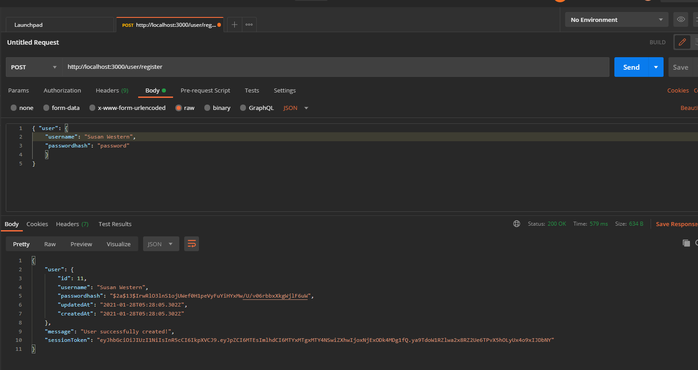
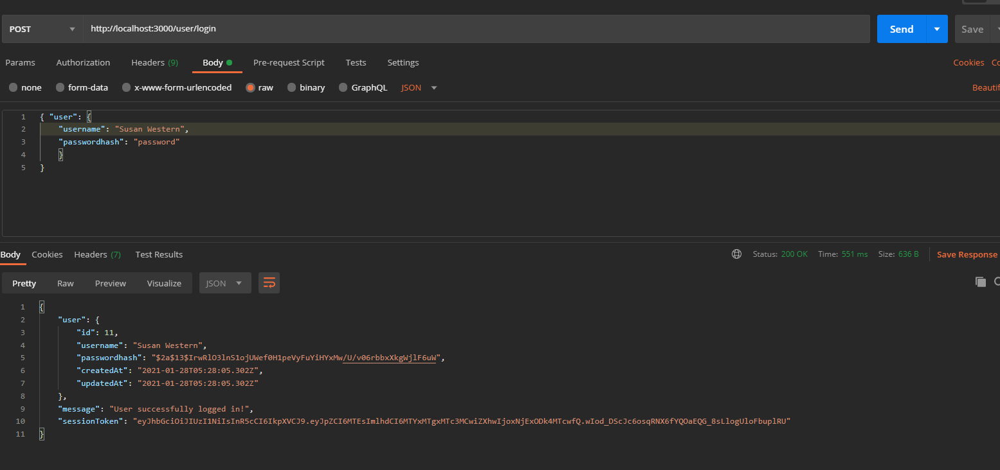
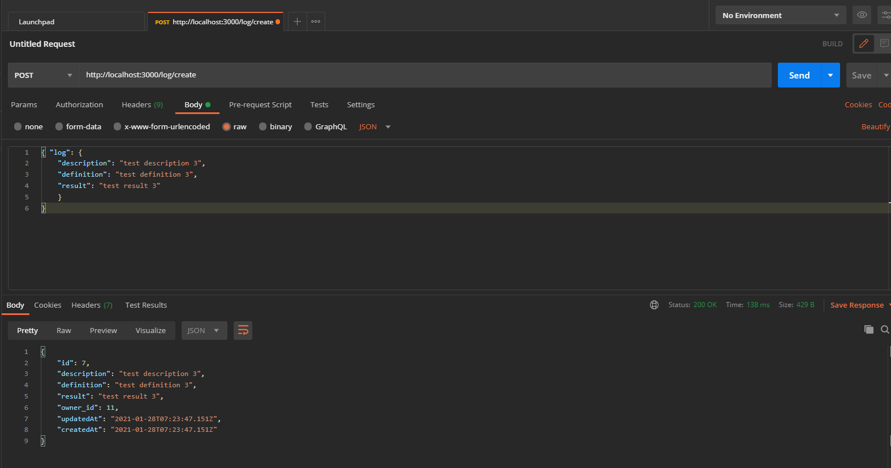
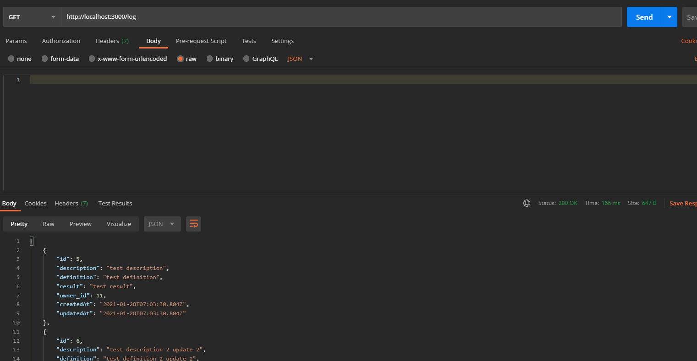
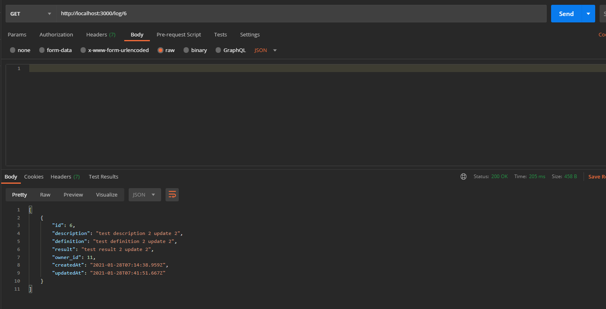
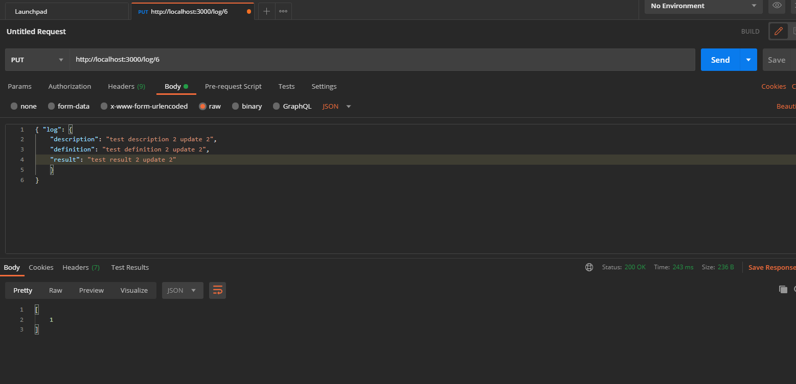
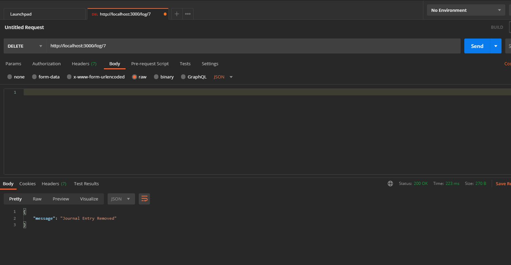

 
  <h1 align="center">Workout Log Server</h3>

## About The Project

This project was intended to provide practice in building a server.

### Project Built With

* [PostgreSQL]()
* [Postman]()
* [JavaScript]()
* [Sequelize]()

## Endpoint Testing

Below are screenshots of the endpoint testing performed in Postman.

* [/user/register POST]()

  

* [/user/login POST]()

  

* [/log/ POST]()

  

* [/log/ GET]()

  

* [/log/:id GET]()

  

* [/log/:id PUT]()

  

* [/log/:id DELETE]()

  

